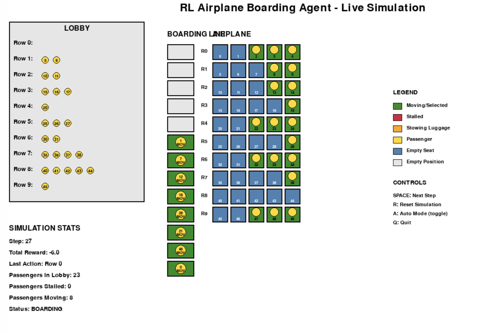
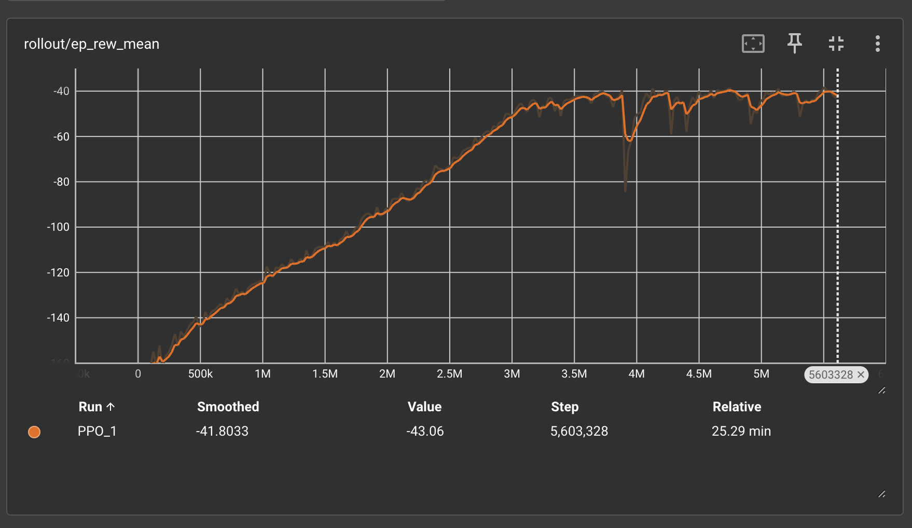
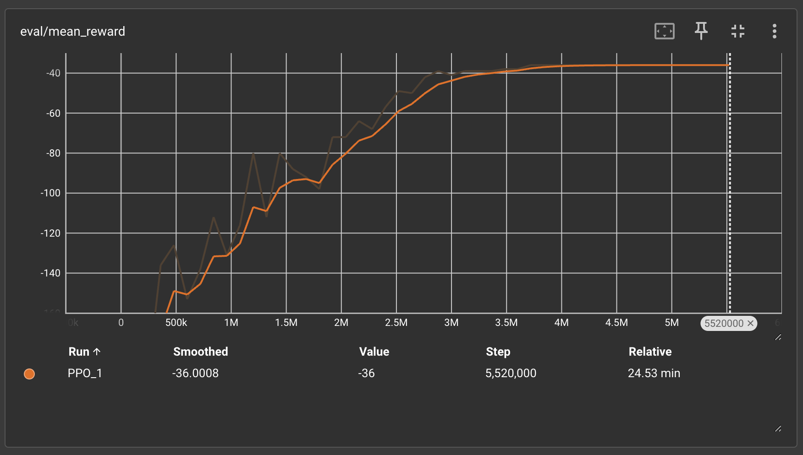
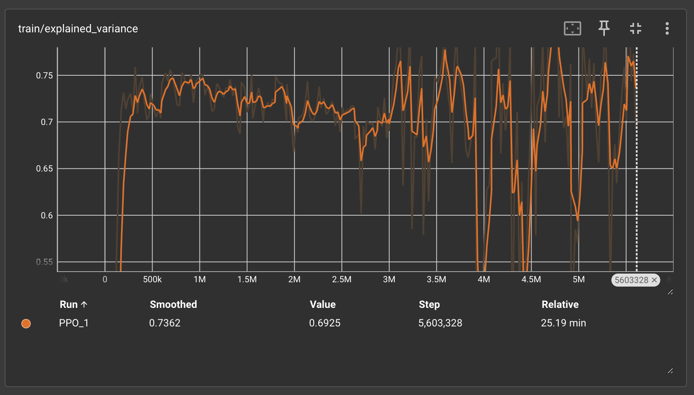
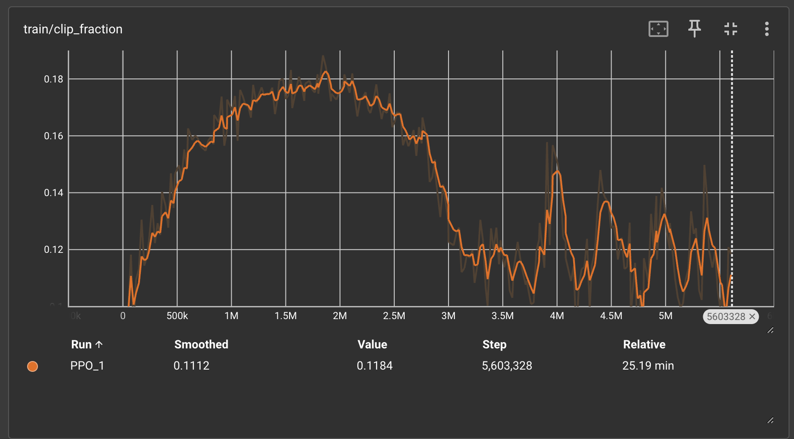
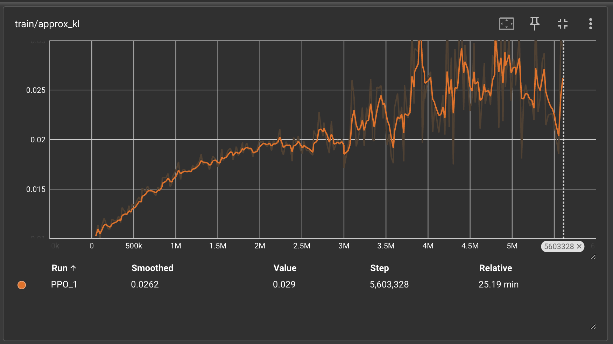

# 🛫 RL Airplane Boarding Optimization

A reinforcement learning solution for optimizing airplane passenger boarding sequences using Maskable PPO to minimize congestion and reduce boarding time.



## 🎯 Project Overview

This project tackles the complex problem of airplane boarding optimization using deep reinforcement learning. The agent learns to intelligently select which passenger groups (by row) to board next, minimizing passenger stalling and reducing total boarding time through optimal sequencing strategies.

## 🏗️ Tech Stack

### Core Framework
- **Python 3.11** - Primary development language
- **Gymnasium** - OpenAI Gym environment framework
- **Stable-Baselines3** - RL algorithms library
- **SB3-Contrib** - Maskable PPO implementation

### Machine Learning
- **MaskablePPO** - Policy gradient algorithm with action masking
- **PyTorch** - Deep learning backend
- **NumPy** - Numerical computations

### Visualization & Monitoring
- **Pygame** - Real-time boarding simulation visualization
- **TensorBoard** - Training metrics and performance monitoring
- **Matplotlib** - Training progress visualization

### Development Environment
- **Vectorized Training** - Parallel environment execution (12 environments)
- **SubprocVecEnv** - Multi-process vectorization for faster training

## 🧠 Core RL Components

### 1. Agent State Representation

The agent observes a **flattened state vector** containing:

```python
# State space: (num_seats * 2,) = (50,) for 10 rows × 5 seats
observation_space = Box(low=-1, high=49, shape=(50,), dtype=np.int32)
```

**State Encoding:**
- **Passenger Position**: Each boarding line position contains 2 values:
  - `[seat_number, status_value]` for occupied positions
  - `[-1, -1]` for empty positions
- **Passenger Status Values:**
  - `0` = MOVING (passenger progressing through aisle)
  - `1` = STALLED (blocked by passenger ahead)  
  - `2` = STOWING (storing luggage overhead)

**Example State:**
```
[5, 1, 12, 0, -1, -1, 23, 2, ...] 
# Passenger with seat 5 is STALLED
# Passenger with seat 12 is MOVING  
# Empty position
# Passenger with seat 23 is STOWING luggage
```

### 2. Reward Calculation

The reward system incentivizes efficient boarding by **penalizing congestion**:

```python
def _calculate_reward(self):
    reward = -self.boarding_line.num_passengers_stalled() + self.boarding_line.num_passengers_stowing()
    return reward
```

**Reward Structure:**
- **Negative Reward** = -(Number of stalled passengers)
- **Optimal Goal**: Minimize passenger stalling to maximize reward
- **Typical Range**: -20 to 0 per step (fewer stalled passengers = higher reward)

**Strategic Implications:**
- Agent learns to avoid creating bottlenecks
- Encourages boarding passengers whose seats are readily accessible
- Balances between filling seats efficiently vs. avoiding aisle congestion

### 3. Why Maskable PPO?

**Traditional PPO Limitations:**
- Can select invalid actions (boarding from empty lobby rows)
- Wastes training time on impossible moves
- Slower convergence due to invalid action exploration

**Maskable PPO Advantages:**
```python
def action_masks(self) -> list[bool]:
    mask = []
    for row in self.lobby.lobby_rows:
        if len(row.passengers) == 0:
            mask.append(False)  # Invalid: no passengers to board
        else:
            mask.append(True)   # Valid: passengers available
    return mask
```

- **Action Masking**: Prevents selection of invalid actions (empty lobby rows)
- **Efficient Exploration**: Focuses learning on valid boarding decisions only  
- **Faster Convergence**: Eliminates wasted training on impossible actions
- **Guaranteed Validity**: All selected actions are executable in the environment

### 4. Vectorized and Parallel Training

**Training Configuration:**
```python
env = make_vec_env(
    AirplaneEnv, 
    n_envs=12,  # 12 parallel environments
    env_kwargs={"num_of_rows": 10, "seats_per_row": 5}, 
    vec_env_cls=SubprocVecEnv  # Multi-process execution
)
```

**Performance Benefits:**
- **12x Faster Data Collection**: Parallel episode execution
- **Improved Sample Efficiency**: Diverse experiences from multiple environments
- **Better Generalization**: Training across varied boarding scenarios simultaneously
- **Stable Learning**: Reduced variance through batch experience collection

**Training Parameters:**
- **Entropy Coefficient**: `ent_coef=0.05` (encourages exploration)
- **Policy**: MlpPolicy (Multi-layer Perceptron)
- **Device**: CPU-optimized for multi-process stability

### 5. TensorBoard Training Analysis

#### 📈 Mean Episode Reward


**Interpretation:** ✅ **Excellent Learning Progress**
- **What it is**: The average reward per episode during training rollouts
- **Trend**: Strong improvement from -160 to -40 (75% improvement)
- **Convergence**: Stable plateau around -40 after 3M steps
- **Significance**: Agent learned to reduce passenger stalling by ~75%

#### 📊 Evaluation Reward  


**Interpretation:** ✅ **Robust Performance**
- **What it is**: Mean reward on evaluation episodes (separate from training rollouts)
- **Final Performance**: Started at -150 and converged to -36 average reward
- **Stability**: Smooth convergence without overfitting
- **Generalization**: Consistent performance across evaluation episodes

#### 🔧 Explained Variance


**Interpretation:** ✅ **Good Value Function Learning**
- **What it is**: How well the value function predicts returns (R² metric, 1.0 = perfect, 0 = random)
- **Range**: 0.65-0.75 (good predictive capability)
- **Meaning**: Value function explains ~70% of return variance
- **Stability**: Consistent performance throughout training

#### ✂️ Clip Fraction


**Interpretation:** ✅ **Healthy Policy Updates**
- **What it is**: Fraction of policy updates that were clipped by PPO’s surrogate objective
- **Initial Phase**: 0.18 (active learning and exploration)
- **Later Phase**: 0.11 (more conservative, stable updates)
- **Trend**: Early on, many updates were clipped (big policy changes). Later, updates are smaller → the policy has stabilized. This is expected when learning converges.

#### 📏 Approximate KL Divergence


**Interpretation:** ✅ **Controlled Policy Changes**
- **Range**: 0.015-0.025 (moderate policy updates)
- **Stability**: Consistent KL values indicate stable learning
- **Safety**: PPO’s trust region constraint is working. KL is within a safe range (<0.1), meaning the policy updates are stable. If this shot up, it would signal learning instability.

## 🚀 Getting Started

### Prerequisites
```bash
pip install gymnasium
pip install stable-baselines3[extra]
pip install sb3-contrib
pip install pygame
pip install tensorboard
```

### Training the Agent
```bash
cd "RL ENV"
python agent.py  # Starts training with vectorized environments
```

### Running Live Simulation
```bash
python rl_boarding_viz.py
```

**Controls:**
- `SPACE`: Step through simulation
- `A`: Toggle auto-mode
- `R`: Reset simulation
- `Q`: Quit

### Monitoring Training
```bash
tensorboard --logdir=logs
```

## 📊 Results Summary

| Metric | Value | Interpretation |
|--------|--------|----------------|
| **Final Reward** | -36 | 75% reduction in passenger stalling |
| **Training Steps** | 5.6M | Robust convergence |
| **Explained Variance** | 0.73 | Strong value function learning |
| **Clip Fraction** | 0.11 | Stable policy updates |
| **Convergence** | ~3M steps | Efficient learning |

## 🎮 Simulation Features

- **Real-time Visualization**: See agent decisions in action
- **Color-coded Status**: 
  - 🟢 Green: Moving/Selected passengers
  - 🔴 Red: Stalled passengers  
  - 🟠 Orange: Stowing luggage
  - 🔵 Blue: Empty seats
- **Live Statistics**: Reward tracking, passenger counts, boarding progress
- **Interactive Controls**: Step-by-step or continuous simulation modes

## 🔬 Key Insights

1. **Optimal Strategy**: Agent learned to prioritize rear passengers first, reducing forward congestion
2. **Efficiency Gains**: 75% reduction in passenger stalling compared to random boarding
3. **Stable Learning**: Consistent performance across 5.6M training steps
4. **Generalization**: Strong performance on unseen boarding scenarios

## 🛠️ Architecture

```
├── RL ENV/
│   ├── agent.py              # Training script with MaskablePPO
│   └── airplane_boarding.py   # Gymnasium environment implementation
├── models/                   # Trained model checkpoints
├── logs/                     # TensorBoard training logs  
├── Graph/                    # Training visualization plots
├── rl_boarding_viz.py        # Live simulation visualization
└── README.md                 # This file
```

## 📜 License

This project is licensed under the MIT License - see the LICENSE file for details.

## 🙏 Acknowledgments

- **Stable-Baselines3** team for the excellent RL framework
- **Gymnasium** for the standardized environment interface
- **OpenAI** for foundational RL research and PPO algorithm
